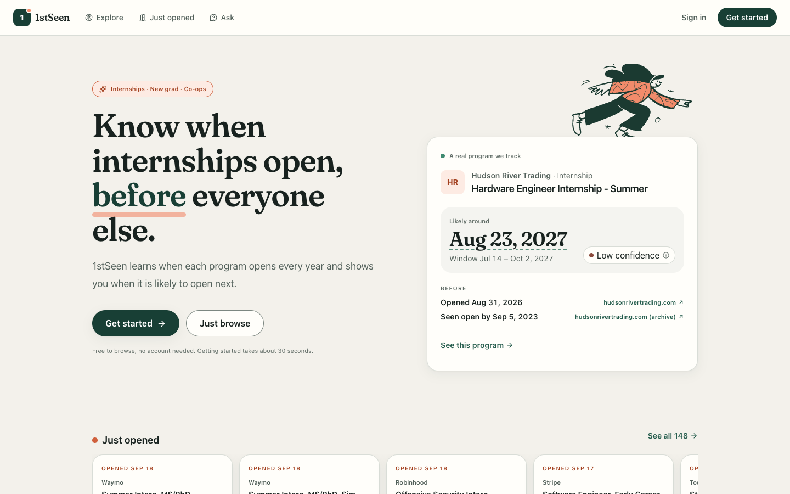
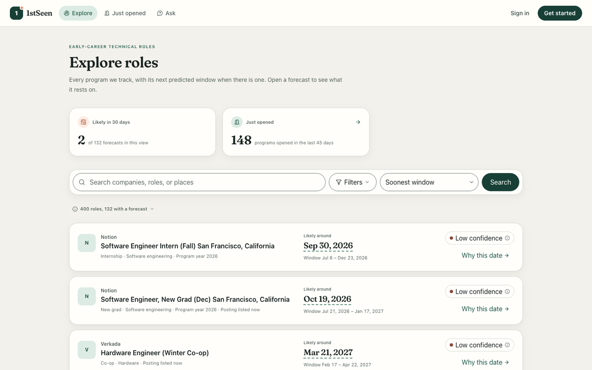
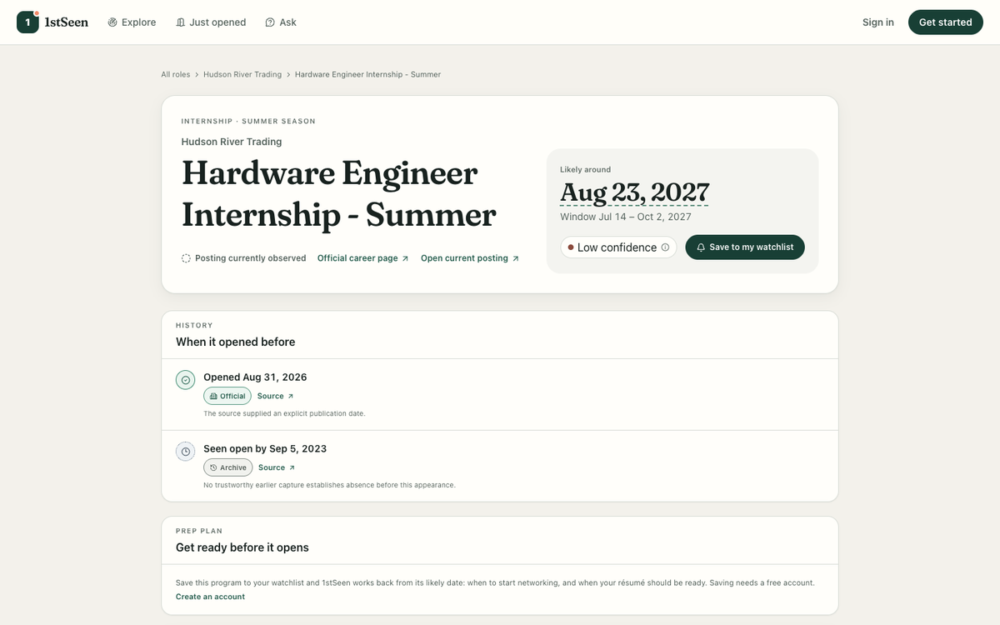
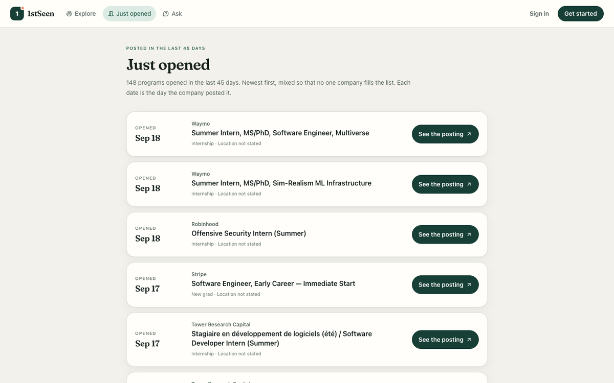
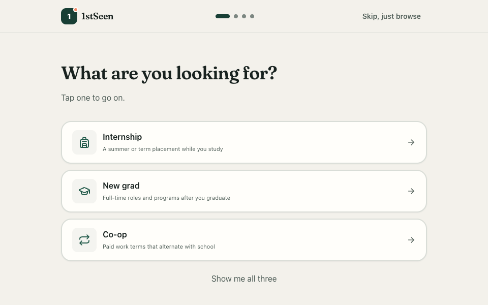
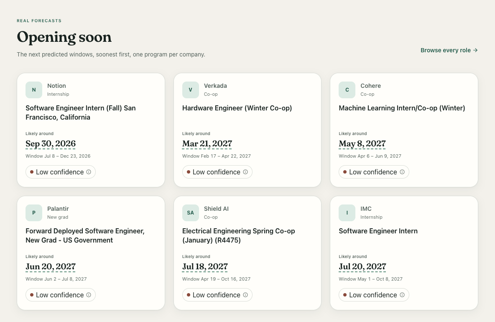
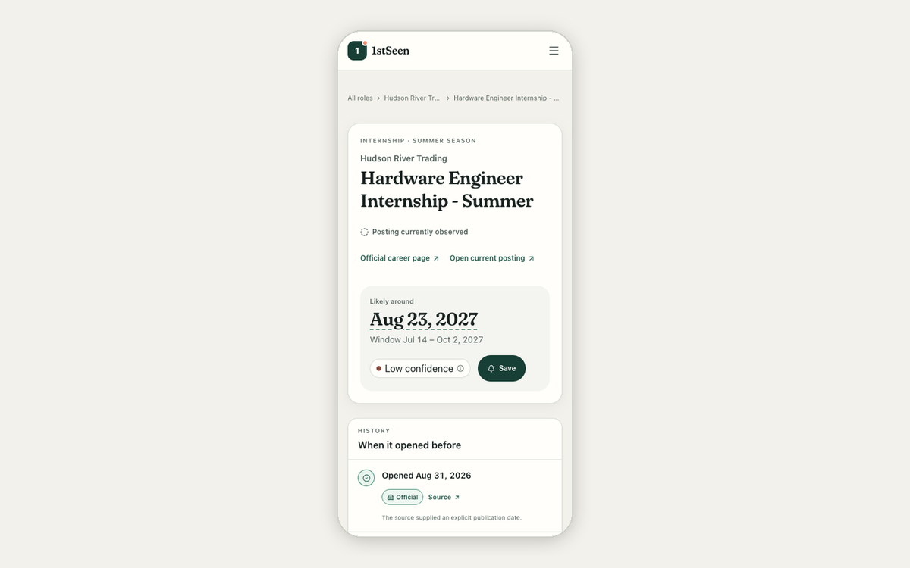

<h1 align="center">1stSeen</h1>

<strong>Know when internships open, before everyone else.</strong>

<h3 align="center"><a href="https://1stseen.win">Open 1stseen.win &rarr;</a></h3>

  

## What it does

- **Just opened:** a live feed of internships and new-grad programs that opened in the last 45 days, each linked to its posting.
- **Likely opening dates:** for programs that open every year, the date each is most likely to open next, the window around it, and a plain Low, Medium, or High confidence.
- **A prep plan for the roles you watch:** save a program and 1stSeen works back from its likely date, so you know when to start networking and when your résumé should be ready.

## Screenshots

| Explore every program | A program's page |
| :---: | :---: |
|  |  |
| **Just opened** | **Getting started** |
|  |  |
| **Opening soon, on the home page** | **On a phone** |
|  |  |

## How it works

1stSeen collects postings from companies' public job boards and from archived copies of their career pages going back several years. From those dates it learns when each program tends to open every year. A statistical model, not an AI, turns that history into each prediction: a likely opening date, the window around it, and how confident it is. When a program has too little history, 1stSeen says so instead of guessing. Every date links to the page where it was seen.

## Built with

- **Web app:** TypeScript on Cloudflare Workers
- **Database:** Supabase Postgres
- **Collection and forecasting:** Python, with the question-answering service on Google Cloud Run
- **Scheduling:** GitHub Actions, collecting current postings twice a day

## Engineering highlights

- **Database requests that no longer grow with the data.** Collection used to talk to the database one row at a time. Reading each company's evidence once and writing in bulk cut requests from about 12,600 to about 50 per 1,000 observations (34,528 to 137 on a 2,747-observation run, with identical results).
- **Three kinds of dates, never merged.** A past opening is exact (the job board's own posting date), bounded (between two archived snapshots, one without the posting and one with it), or seen open by (only known to be visible by then). They are stored apart, never promoted into one another, and weighed differently by the model.
- **Guest limits that hold.** Visitors without an account can ask 5 questions a minute. Cloudflare's built-in rate limiting let 13 requests through from one address when set to 3 a minute, so each limit is counted exactly by a Durable Object instead.
- **robots.txt respected.** In production, collection reads each site's robots.txt before every request and skips whatever it disallows, including whole job boards.
- **Every number checked.** The test suite recomputes each count the site shows (totals, filters, first-run results, a program's past openings) with independent database queries and fails on any mismatch.

## Run it locally

Everything runs on one machine with no hosted accounts: Node 22.13+, Python 3.11+, and Docker.
Start with `make setup`, then follow [docs/local-development.md](docs/local-development.md).

## Documentation

The methods, operations, and reviews behind the product are in the [docs index](docs/README.md).

---

Opening dates on 1stSeen are predictions from each program's public posting history, and their accuracy is not yet validated. 1stSeen is independent, and not affiliated with or endorsed by any company it lists. [Terms](https://1stseen.win/terms) · [Privacy](https://1stseen.win/privacy)
